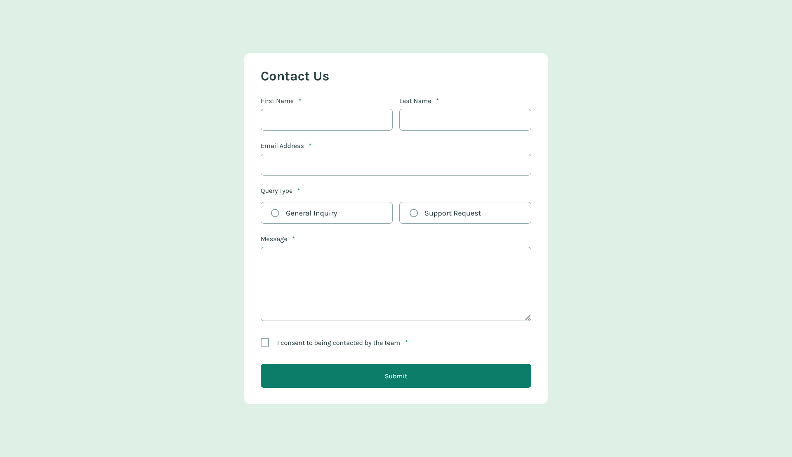
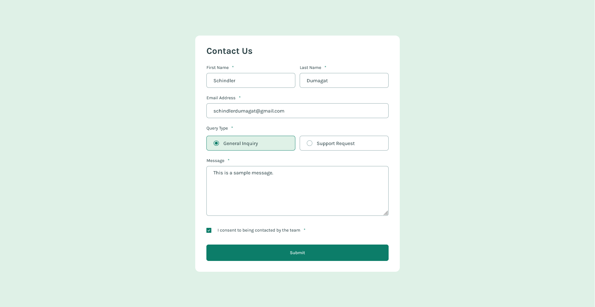
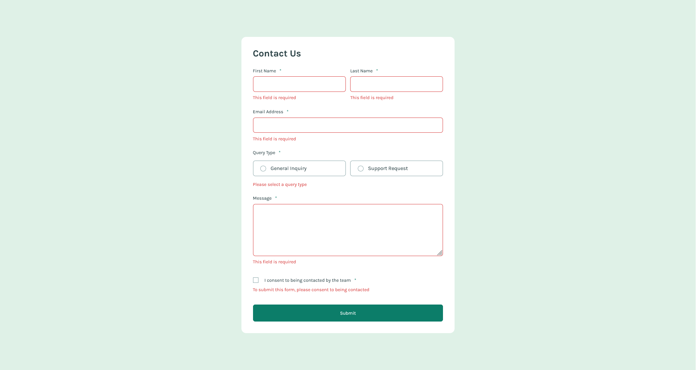
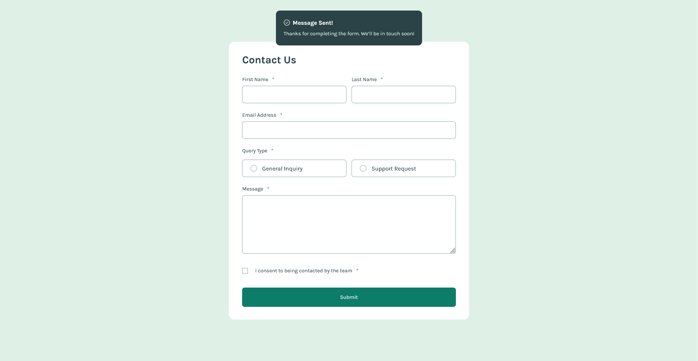

# Frontend Mentor - Contact form solution

This is a solution to the [Contact form challenge on Frontend Mentor](https://www.frontendmentor.io/challenges/contact-form--G-hYlqKJj). Frontend Mentor challenges help you improve your coding skills by building realistic projects. 

## Table of contents

- [Overview](#overview)
  - [The challenge](#the-challenge)
  - [Screenshot](#screenshot)
  - [Links](#links)
- [My process](#my-process)
  - [Built with](#built-with)
  - [What I learned](#what-i-learned)
  - [Continued development](#continued-development)
  - [Useful resources](#useful-resources)
- [Author](#author)

## Overview

This project focuses on form handling and accessibility. It has a custom JavaScript validation logic with error handling and success state. It is accessible to keyboard only users and it also reports appropriate error messages.

### The challenge

Users should be able to:

- Complete the form and see a success toast message upon successful submission
- Receive form validation messages if:
  - A required field has been missed
  - The email address is not formatted correctly
- Complete the form only using their keyboard
- Have inputs, error messages, and the success message announced on their screen reader
- View the optimal layout for the interface depending on their device's screen size
- See hover and focus states for all interactive elements on the page

### Screenshot

Initial State:


Filled State:


Error State:


Success State:


### Links

- Solution URL: [https://www.frontendmentor.io/solutions/contact-form-page-with-custom-javascript-form-handling-2TZIkpFCD8](https://www.frontendmentor.io/solutions/contact-form-page-with-custom-javascript-form-handling-2TZIkpFCD8)
- Live Site URL: [https://schindlerdumagat.github.io/contact-form/](https://schindlerdumagat.github.io/contact-form/)

## My process

1. Inspect the Figma Design.
2. Download the necessary fonts, add preload links in HTML and declare it in CSS. 
3. Create the base CSS setup (Add CSS Reset, Font Declaration, CSS Tokens, Initial body style rules)
4. Create the HTML markup based on the design
5. Implement all the styling rules (initial element styles, error styles, responsive design, etc.)
6. Implement the JavaScript logic (Event Listeners, Form Validation, Error Handling, Success State, etc.)
7. Refactor to make it cleaner
8. Get it reviewed by AI and learn it, then apply the feedback.

### Built with

- Semantic HTML5 markup
- CSS custom properties
- Flexbox
- CSS Grid
- JavaScript
- Mobile-first workflow
- [BEM](https://getbem.com/) - Block, Element, Modifier

### What I learned

I learned how to structure my HTML code in dealing with forms. I made use that a form input is connected to its label and error message element.

```html
<div class="form__field form__email">
  <label class="form__label" for="email">Email Address <span class="form__required" aria-label="Required field">*</span></label>
  <input class="form__input" type="email" id="email" name="email" autocomplete="email" required aria-describedby="email-error">
  <span class="form__error" id="email-error" aria-live="polite"></span>
</div>
```

I learned how to create a validation logic and organized it using a JavaScript object.

```js
const validations = {
    isEmpty: (value) => value.trim().length === 0 && "This field is required",
    isEmail: (value) => !validEmailRegex.test(value) && "Please enter a valid email address",
    hasQueryValue: (value) => !value && "Please select a query type",
    isWithinRange: (value) => value.trim().length < 15 && "Message must be minimum of 15 characters",
    isChecked: (value) => !value && "To submit this form, please consent to being contacted",
}
```

### Continued development

Because of the complexity of form handling, I will continue to learn more about it and practice it by building more projects. I will also learn how to handle forms in React applications.

### Useful resources

- [Client Side Form Validation](https://developer.mozilla.org/en-US/docs/Learn_web_development/Extensions/Forms/Form_validation#validating_forms_using_javascript) - This helped my get started with form handling and learned some of the ways you can validate forms.

## Author

- Website - [Website Portfolio](https://schindlerdumagat.github.io/webportfolio/)
- Frontend Mentor - [@schindlerdumagat](https://www.frontendmentor.io/profile/schindlerdumagat)
- LinkedIn - [@schindler-linkedin](https://www.linkedin.com/in/schindler-dumagat-015238230/)
